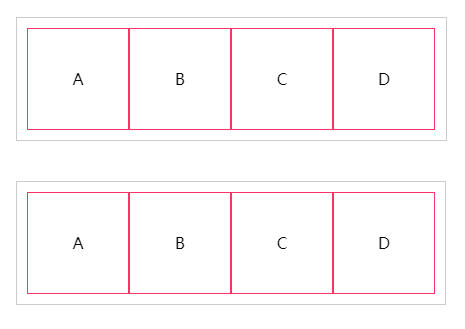
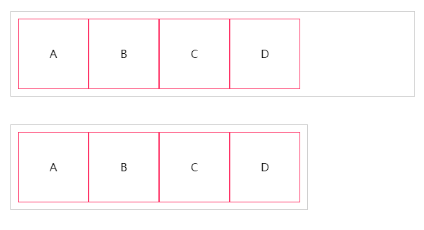

## Flexbox
### 1：术语
- display:开启Flexbox,让一个元素变成伸缩容器
- justify-pack:主轴对齐方式，用来指定伸缩项目沿主轴的对齐方式
- align-items:侧轴对齐方式，用来指定伸缩项目沿侧轴的对齐方式
- align-content:伸缩项目行对齐方式，指定伸缩项目行在侧轴的对齐方式，这种情况只是在伸缩
容器设置为设置为flex-wrap为warp时，**并且没有足够的空间将伸缩项目放在同一行中**
。即这个属性在伸缩项目有多行时才可以生效
- aligin-self:单个伸缩项目的对齐方式，指定但是收缩项目在侧轴方式，这个属性类似侧轴对齐方式属性，用来覆盖
伸缩项目在伸缩容器中的侧轴的对齐方式。
- order:显示顺序，用来指定伸缩项目的顺序
- flex:伸缩性，指定伸缩项目如何伸缩尺寸，控制伸缩项目在伸缩容器中扩展或收缩伸缩项目的宽度
来来填充伸缩容器的额外空间
- flex-direction:伸缩流，控制伸缩项目在没有足够空间的伸缩容器中是否换行
- flex-wrap:换行，指定伸缩项目是否沿着侧轴排列。

```
扩展
Flexbox会有标准版本、混合版本、老版本，使用时需要区分。
看到“box,box-{*}”,"flexbox,flex()函数"，“flex,flex-{*}”属性，分别对应2009,2011以及当前版本
```
### 2:兼容旧版语法与新版写法
为了让Safari浏览器下能够正常使用Flexbox模型，需要掌握旧版本Flexbox模型的基本使用

#### 2.1：display

使用display属性让一个元素变成伸缩容器

display: box | inline-box
display: flexbox | inline-flexbox






对比效果可以明显的发现，如果给元素设置块伸缩容器，其效果类似块元素的渲染风格，**不过在firefox下和inline-block风格一致**，如果给
元素设置内联级伸缩容器，其效果类似于inline-block风格

#### 2.2:伸缩流方向 box-orient

用来创建主轴，定义伸缩项目在伸缩容器中的流动布方向
，即用来指定伸缩项目如何放置在伸缩容器的主轴上
box-orient: horizontal | vertical | inline-axis | block-axis
flex-direction: row | row-reverse | column | column-reverse

伸缩流的方向和文本书写模式有关系，书写模式的lte与rtl会影响，horizontal和inline-axis，书写模式直接影响了排列方向
给伸缩容器设置horizontal和inline-axis值后，可以修改文档流的默认显示方式，在垂直方向上从上向下显示，而给伸缩容器设置vertaical和block-axis值，其显示的方式和
文档流默认显示的方式一样

#### 2.3：布局顺序 box-direction

用来设置伸缩项目在伸缩容器中的流动顺序

box-direction: normal | reverse

属性与文本书写模式有关，ltr于rtl时的默认方向是不同的

#### 2.4：伸缩换行 box-lines

针对传统的盒模型的overflow，在flexbox模型中可以使用
伸缩换行属性box-lines来控制伸缩项目是否溢出伸缩容器

box-lines: single | multiple
flex-wrap: nowarp | warp | warp-reverse

**未有浏览器支持**

#### 2.5 主轴对齐 box-pack

指定对齐用来设置当前伸缩项目在主轴方向的对齐方式，指定如何在
伸缩项目之间分布伸缩容器的额外空间

box-pack: start | end | center | jsutify
flex-pack: start | end | center | justify | distribute
(distribute:伸缩项目平均分布在同一行，两端保留伸缩项目间距一半的空间)

box-orient与box-pack属性的值可直接管理伸缩容器额外空间，box-pack除了和
伸缩流的方向有关外还和box-direction有关

#### 2.6 侧轴对齐 box-align
管理伸缩容器的侧轴方向的额外空间，定义伸缩项目在伸缩容器的当前行的侧轴上
对齐方式

box-align: start | end | center | baseline | stretch
flex-align: start | end | center | baseline | stretch

注意baseline是针对基线对齐，所谓的基线，是小写的x的下方位置，所有伸缩项目的基线都彼此对齐，
占有空间最多且垂直于布局轴的伸缩项目遵循start规则。

#### 2.7 伸缩性box-flex
控制伸缩项目在伸缩容器中的显示空间，显示空间包括伸缩项目的宽度与高度，即伸缩项目在伸缩空间中占的面积

box-flex: <number>

类似android的weight字段

#### 2.8 显示顺序box-ordinal-group

伸缩容器中的伸缩项目默认的显示顺序是按照文档流在源码中出现的先后顺序，在flexbox模型中，伸缩项目具有自己独立的源顺序。

box-ordinal-group:<integer>

integer默认为1，值越大排序越靠后。